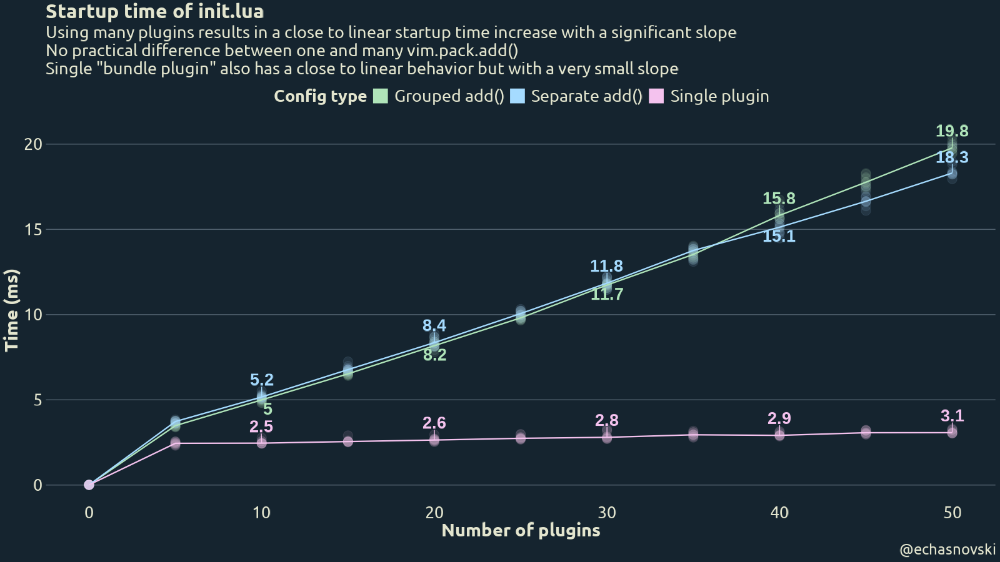
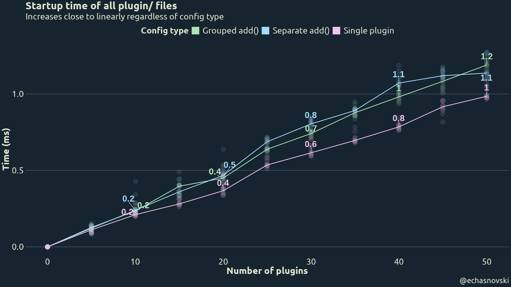
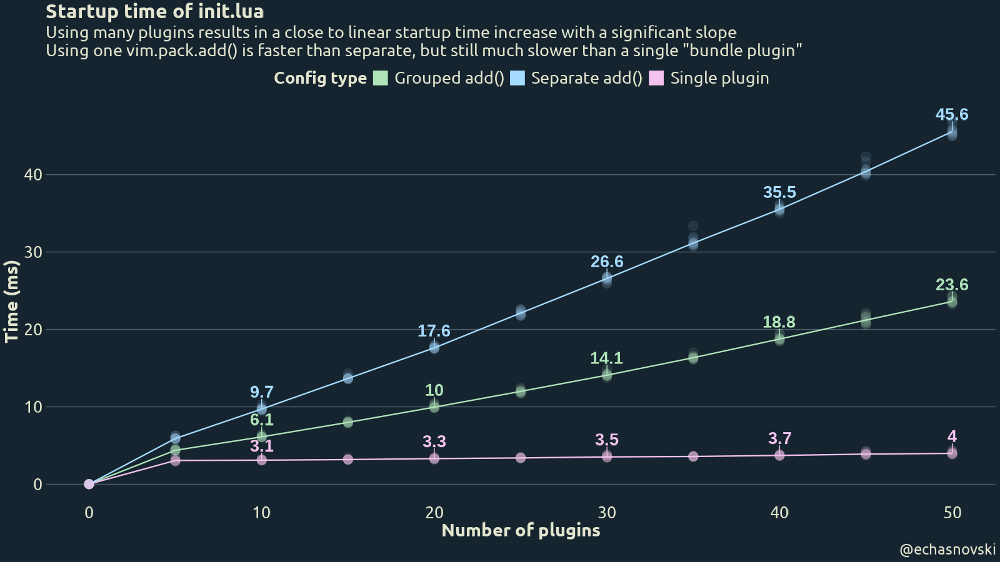
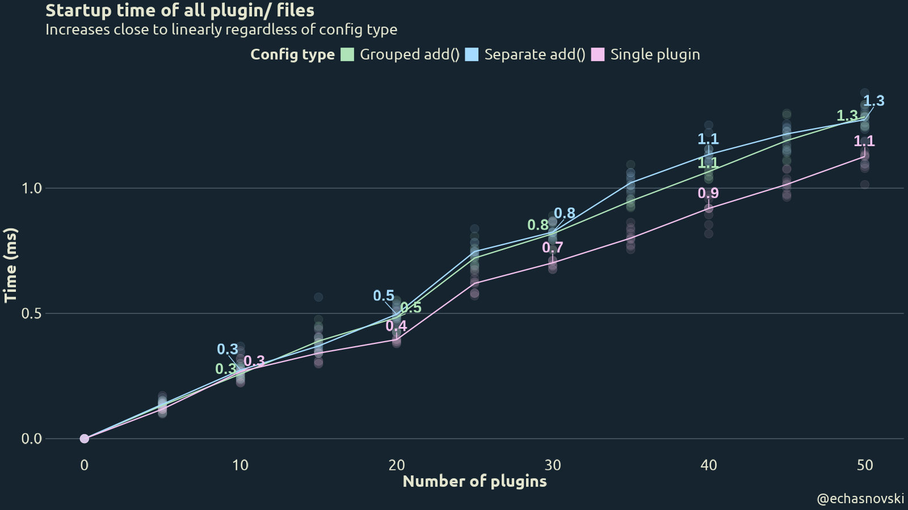
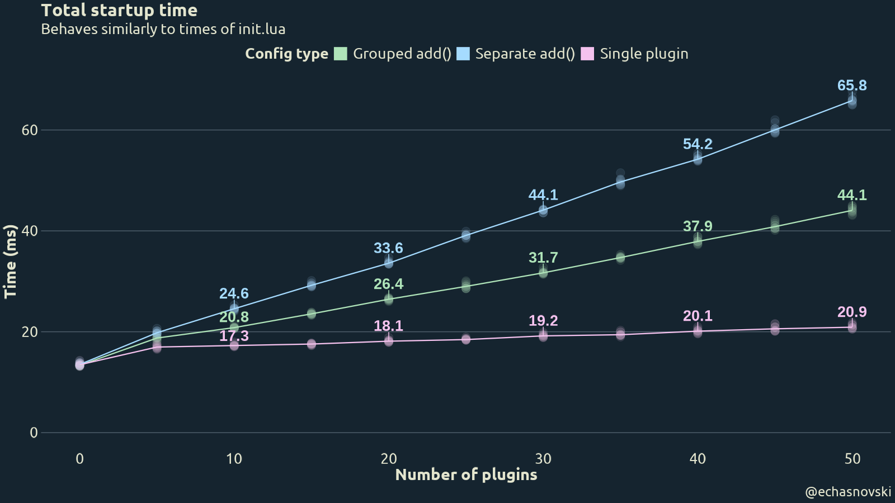
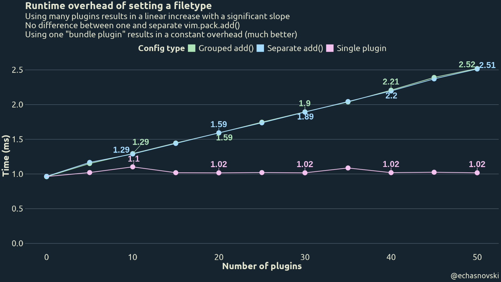

First, to directly answer the implied question in the title: there is no specific number. Each Neovim user decides for themselves how many plugins bring the most joy out of using the editor. It can be as low as zero and as many as 100+.

What I am curious about is how the number of loaded plugins affects overall performance of using Neovim.

## Motivation

There are at least two main reasons for me to explore this:

- Measure a performance benefit of using ['mini.nvim'](https://nvim-mini.org/mini.nvim/) as a single plugin instead of many its standalone repos.
- Get an actual data about whether lazy loading can be objectively justified from at least performance point of view.

I know there should be a performance difference in both cases since loading a plugin adds a path entry in [Neovim's runtime](https://neovim.io/doc/user/helptag.html?tag='runtimepath'). This is a way to make Neovim "know" about available plugin code/data and use it whenever needed. Like when:

- Doing `require('module-name')` the first time for 'module-name' yields searching through all known 'lua/' runtime directories.
- Assigning filetype to a buffer (which is a fairly frequent action) yields searching through 'ftplugin/' runtime directories to load filetype plugin script(s).

    I don't have an accurate estimation of how frequent this happens. Especially since it highly depends on which plugins are used (as they tend to set filetype for their internal buffers). But my quick testing on Neovim>=0.12 with `vim._core.ui2` enabled hints that it can be in the vicinity of 500 per active Neovim usage session.

- Attaching an LSP client on Neovim>=0.11 yields searching through 'lsp/' runtime directories.
- And so on. More information is in above link about Neovim's runtime, plus [`:h :runtime`](https://neovim.io/doc/user/helptag.html?tag=:runtime) and [`:h runtime-search-path`](https://neovim.io/doc/user/helptag.html?tag=runtime-search-path)

## Benchmark

The only way to answer these questions is by designing and performing benchmarks. Here I'll describe the necessary basics of what was done, but you can find exact scripts and possibly more details [here](https://github.com/echasnovski/curiosity-projects/tree/master/neovim-plugin-number).

There are reasonably two performance aspects to benchmark: startup and runtime (i.e. everything after startup).

The main effect of loading plugins on startup performance is due to increasing 'runtimepath' value and immediately using it during startup. The two most common example here are: execute `require('plugin-name')` (like when using its method to enable and/or configure the plugin) and Neovim's automatic sourcing of 'plugin/' files.

The main effect on runtime performance should be just increased 'runtimepath'. So this is not quite plugin number specific, but installing plugins is the main way to increase the number of runtime paths.

With that in mind, I settled on the following benchmarking approach:

- One benchmark is done for a combination of a number of loaded plugins (`n_plugins`) and the way they are loaded (`config_type`).

- Procedurally generate each plugin so that it has rudimentary but plausible 'lua/' and 'plugin/' code. See ["Plugin code"](#plugin-code).

- Procedurally generate several config types describing how plugins are loaded via [`vim.pack`](https://neovim.io/doc/user/helptag.html?tag=vim.pack) (available on Neovim>=0.12). The whole config is basically a single 'init.lua' file. See ["Config types"](#config-types).

- Run the Neovim with the config once to install necessary plugins.

- Measure startup by doing the equivalent of `nvim --startuptime file-{config_type}-{n_plugins}` 10 times to later average out. From startup log file extract:
    - How long did it take to source 'init.lua'.
    - How long did it take to source all 'plugin/' files.
    - Overall startup time.

- Once per benchmarked `config_type`+`n_plugins` combo set filetype and measure time it took. Repeat many times with each try for a fresh buffer and for a filetype that doesn't have filetype scripts (to not include their source time in benchmarks). Take a median time as a benchmark result. I settled on 1001 times per each combo, which should be enough to get stable sub millisecond precision.

- Tested loaded plugin numbers: 0, 5, 10, ..., and 50 loaded plugins. Include zero for a sanity check and to get a reference for a total startup time.

::: {.callout-note}
Benchmarks were done at the time when Neovim 0.12 is still in development. The AppImage with the following version was used:

```
NVIM v0.12.0-dev-2435+g18c5f06c9f
Build type: RelWithDebInfo
LuaJIT 2.1.1771967821
```
:::

### Plugin code {#plugin-code}

Each plugin has a very simple placeholder functionality and is written with "good practices" in mind. In particular, plugin number `NN` (which is a number from 01 to `n_plugins`, the total number of loaded plugins) contains:

```{.lua filename="lua/pluginNN.lua"}
local run = function() _G.value = "PluginNN" end
local config = function() _G.pluginNN = { "PluginNN" } end
return { config = config, run = run }
```

```{.lua filename="plugin/pluginNN.lua"}
vim.api.nvim_create_user_command("PluginNN", function() require("pluginNN").run() end, {})
vim.keymap.set("n", "<Plug>(PluginNN)", function() require("pluginNN").run() end)
```

It is generated inside 'host/' subdirectory of current working directory and installed using `file:///path/to/working/directory/host/pluginXX` as a source.

### Config types {#config-types}

Three types of configs are benchmarked:

1. `Grouped add()` - many independent plugins are installed and loaded as a group in a single `vim.pack.add()` call and later configured. This is the most robust and straightforward way to install many plugins with `vim.pack`.

    ```{.lua filename=init.lua}
    vim.pack.add({
      'file:///path/to/working/directory/host/plugin01',
      -- ...
      'file:///path/to/working/directory/host/pluginXX',
    }, { confirm = false })

    require('plugin01').config()
    -- ...
    require('pluginXX').config()
    ```

2. `Separate add()` - many independent plugins are installed, loaded, and configured in "sequential" manner. This installs and loads one plugin at a time while immediately configuring it. This is meant to check if having plugin entry in 'runtimepath' closer to its start (since `:packadd` from `vim.pack.add()` adds an entry very close to the start) adds a meaningful startup improvement (as `require('pluginNN')` then needs to traverse fewer directories). SPOILER: it's complicated.

    ```{.lua filename=init.lua}
    vim.pack.add({ 'file:///path/to/working/directory/host/plugin01' }, { confirm = false })
    require('plugin01').config()

    -- ...

    vim.pack.add({ 'file:///path/to/working/directory/host/pluginXX' }, { confirm = false })
    require('pluginXX').config()
    ```

- `Single plugin` - single plugin that combines all Lua modules and plugin files of separate plugins into one. All 'lua/pluginNN.lua' and 'plugin/pluginNN.lua' files are combined under a single directory. This provides the same functionality as many plugins, but "packaged" in a single plugin. Similar to how 'mini.nvim' is related to its standalone repos. This only adds a single entry to 'runtimepath' and is also used as a reference to compare against.

    ```{.lua filename=init.lua}
    vim.pack.add({ 'file:///path/to/working/directory/host/singleXX' }, { confirm = false })

    require('plugin01').config()
    -- ...
    require('pluginXX').config()
    ```

::: {.callout-note}

All config types use `vim.pack.add()` to install and load plugins. For installed plugins it essentially executes `:packadd!` during startup, so modifies 'runtimepath' immediately. Other plugin managers can and do behave differently while requiring more elaborate ways of delayed execution of `require('pluginNN').config()`.

:::

### Prior expectations

1. Results for 0 loaded plugins do not depend on config type. Nothing loaded in various ways is still nothing loaded. Can be used for a sanity check and reference for total startup time.

2. Startup time is the best for `Single plugin` config type, followed by `Separate vim.pack.add()`, followed by `Grouped vim.pack.add()`.

3. Both "many plugins" approaches visibly grow with the number of plugins.

4. Runtime performance behaves the same for both "many plugins" config types and is visibly worse than for "single plugin".

## Results

**Edit on 2026-02-27**: initial version of this post was done on `v0.12.0-dev-2101+gd93e150888` development version of Neovim. Some observations didn't feel right, which resulted into [me suggesting an optimization upstream](https://github.com/neovim/neovim/issues/37586). It was [promptly addressed](https://github.com/neovim/neovim/pull/37722) by Neovim wizard [@bfredl](https://github.com/bfredl) (the quick turnaround is mostly because it affects the `vim.pack` in the upcoming Neovim 0.12 release). Each section has "Initial results" spoiler preserved for posterity.

### Startup

Here are the results of benchmarking startup time (semi transparent points are actual times, line and text represent median times).






Observations:

- Having zero plugins indeed adds nothing to startup time.

- Best performance is indeed for `Single plugin`. Having constant number of 'runtimepath' entries can save up to 50% of startup time for 50 plugins.

- However, `Separate add()` is not visibly faster than `Grouped add()`. This probably has to do with the fact that 'runtimepath' option has special treatment: it is internally smartly cached on every `:packadd` to increase startup performance.

- Sourcing 'plugin/' does not depend on config type and grows close to linearly with the number of loaded plugins. The exact numbers are rather small, though.

- Total startup time is mostly affected by 'init.lua'.

::: {.callout-note collapse="true"}
## Initial results







- `Separate add()` is *much slower* than `Grouped add()`. At first, I thought that this is a result of constant overhead of a `vim.pack.add` call, but similar results can be seen with `vim.cmd('packadd! pluginXX')`.

  After digging through the Neovim code base (with the help of [Luis Calle](https://github.com/TheLeoP/)), the reason seems to be internal caching. In particular:

    - Searching in `require()` is done by a custom package loader [that uses private `vim.api.nvim__get_runtime()`](https://github.com/neovim/neovim/blob/c28113dd9d09b661061d25c147e39efadc6e700b/runtime/lua/vim/_init_packages.lua#L31).
    - The [private `vim.api.nvim__get_runtime()`](https://github.com/neovim/neovim/blob/c28113dd9d09b661061d25c147e39efadc6e700b/src/nvim/api/vim.c#L652) uses [a helper](https://github.com/neovim/neovim/blob/c28113dd9d09b661061d25c147e39efadc6e700b/src/nvim/runtime.c#L656) that does some caching of runtime files if 'runtimepath' has changed.

    So instead of the expected "Add to 'runtimepath'" -> "`require` searches small number of directories", there is a "Do some 'runtimepath' caching" step in the middle. It seems to have been added with caching `pack/*/start/*` plugins in mind.

    Although quick, it still adds a significant overhead at this millisecond scale of actions. But on the other hand, this approach allows to have more "separated" config structure, which many people like.

- There is an overall and uniform ~10% improvement in startup speed between initial and "new" results. This might be a result of another startup improvement done within a month between benchmarks, since the startup time with zero plugins has improved by the same amount.

    However, since there is a similar improvement in "Runtime" results, it might be due to how the benchmarking machine was feeling on a particular day.
:::

### Runtime



Observations:

- Indeed for both "many plugins" config types runtime performance is the same.

- Switching to a single plugin can drastically reduce runtime overhead complexity from nearly linear to nearly constant.

::: {.callout-note collapse="true"}
## Initial results


:::

## Conclusion

- Loading plugins indeed adds a measurable performance overhead. Both during startup and runtime.

- Reducing the number of loaded plugins (be it by using a single "bundle plugin" or by lazy loading plugins some time later) can measurably improve performance. The saved time grows linearly with the number of reduced plugins and can be as high as 50% of startup/runtime overhead for 50 reduced plugins.

- There is no practical difference between "one `vim.pack.add()`" (load all necessary plugins at once and later configure in a series of `require()` calls) and "separate `vim.pack.add()`" (`vim.pack.add()` -> `require()` -> `vim.pack.add()` -> `require()`). This seems to have to do with internal caching of 'runtimepath' option.

- Are these findings useful? I'd say yes. On paper, the amount of saved time is very small: order of tens of milliseconds during startup and one millisecond during runtime.

  However, Neovim users take pride in their instantaneous startup and runtime performance. When looking at a big picture of a general advice for users, the value of saved time (`number of opening Neovim` x `10 ms` + `number of runtime searching per session` x `1 ms` ~ 5 x 10 + 500 x 1 = 550 ms per day) can be visible if multiplied by the number of users and number of passed days.

- My personal (very biased) recommendation would be this: if you want to optimize startup and runtime performance benchmarked here, switching from many separate plugins to one plugin that provides same/similar functionality is the best course of action here. If that is not possible, then consider doing some simple lazy loading (like after first screen draw or on `InsertEnter`/`CmdlineEnter` events).

  It is also completely fine to not care about millisecond level overhead in favor of using plugins and structure that brings you more joy. In the end, the choice is always up to the user.


