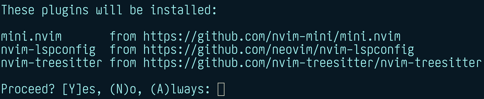
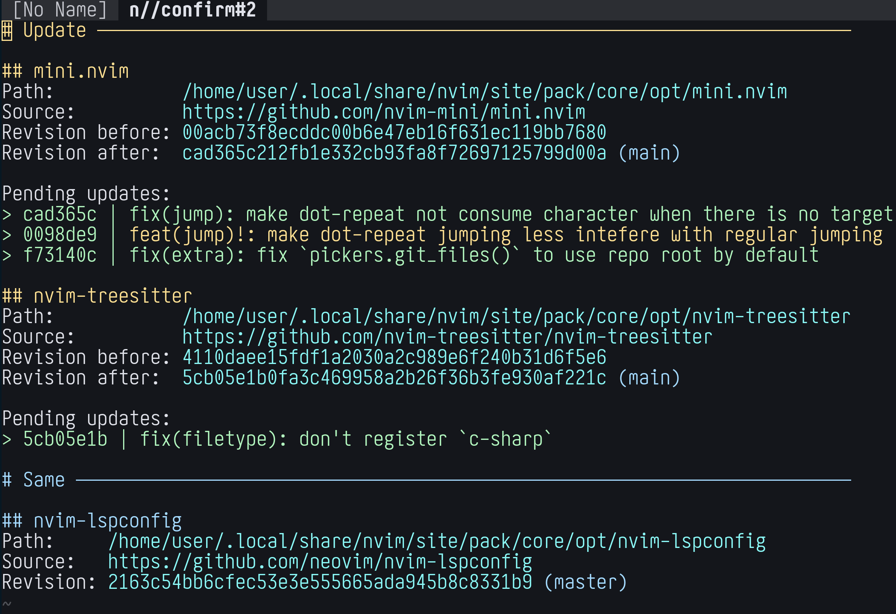

The upcoming Neovim 0.12 release [will have a built-in plugin manager](2025-07-04-neovim-now-has-builtin-plugin-manager.qmd). It is implemented in Lua and is available as a built-in [`vim.pack`](https://neovim.io/doc/user/helptag.html?tag=vim.pack) module (hence the name). This blog post describes the fundamentals of how `vim.pack` is intended to be used. Reading only selected sections should be fine, but it is written to be read from top to bottom.

::: {.callout-note}
Beware that, although unlikely, some information from this post can become outdated. Neovim's own documentation is always the higher authority. From the running Neovim instance execute `:h vim.pack` to read the help and `:h vim.pack-examples` to read suggested workflows for common use cases.
:::

If you are a visual learner or want to see how using `vim.pack` looks like, check out this YouTube video:

::: {.callout-note title="A Demo of vim.pack (Neovim built-in plugin manager)" collapse="true"}

:::

## Concepts

This section lists `vim.pack` adjacent information that would be beneficial to understand before using it.

### Lua

The `vim.pack` module is written and is designed to be used in Lua programming language. So at least a basic understanding of its logic and syntax would be useful.

There are many sources online for the language itself, like ["Learn X in Y minutes where X=Lua"](https://learnxinyminutes.com/lua/). Neovim has its own resources: [`:h lua-concepts`](https://neovim.io/doc/user/helptag.html?tag=lua-concepts) and [`:h lua-guide`](https://neovim.io/doc/user/helptag.html?tag=lua-guide).

The basic working knowledge to know for `vim.pack` is about:

- Tables: `{ 'one', 'two' }` and `{ a = 1, b = 2 }`.
- Functions: `f({ 'one', 'two' })`.
- How to execute code inside user's config: put it in or source from ['init.lua' file](https://neovim.io/doc/user/helptag.html?tag=init.lua).

### Runtime files

To provide extensibility and flexibility, Neovim (and Vim) has a concept of runtime files: various support files that can be found and used when Neovim is running. Where these files are searched is controlled by the ['runtimepath' option](https://neovim.io/doc/user/helptag.html?tag='runtimepath'), which is essentially a list of directories.

Most commonly used types of runtime files when it comes to external plugins in Neovim are:

- Lua modules. Searched in `lua/` subdirectories.
- Plugin scripts. Searched in `plugin/` subdirectories.
- Filetype plugins. Searched in `ftplugin/` subdirectories.

---

For example, if `'runtimepath'` is `/home/user/dir,/home/user/dir-other`, then:

- `require('myplug')` will try to look for `lua/myplug.lua` or `lua/myplug/init.lua` inside `/home/user/dir`, then `/home/user/dir-other`, and source the first one it finds.

- All files in `/home/user/dir/plugin` and `/home/user/dir-other/plugin` are sourced in alphabetical order during startup.

- Setting filetype `myft` will look for `ftplugin/myft.{vim,lua}` inside `/home/user/dir`, then `/home/user/dir-other`, and source all that it finds.

The most important runtime paths for common users available by default are:

- [User's config directory](https://neovim.io/doc/user/helptag.html?tag=$XDG_CONFIG_HOME): `~/.config/nvim` on Unix and `~/AppData/Local/nvim` on Windows. Used for personal config. This is also known as ["config" standard path](https://neovim.io/doc/user/helptag.html?tag=standard-path).

- [The `site/` subdirectory of user's data directory](https://neovim.io/doc/user/helptag.html?tag=$XDG_DATA_HOME): `~/.local/share/nvim/site` on Unix and `~/AppData/Local/nvim-data/site` on Windows. Used for data from plugins installed by user. The parent of `site` directory is also known as ["data" standard path](https://neovim.io/doc/user/helptag.html?tag=standard-path).

- The [`after/` subdirectory](https://neovim.io/doc/user/helptag.html?tag=after-directory) of user's config directory. Primarily used for manual runtime files that should have the "final say" over all others, as it is usually the last 'runtimepath' entry.

---

When it comes to a plugin manager:

- Installing a plugin means to download and put it in the known location on the disk.

- Loading a plugin means to make sure that its path is a proper part of `'runtimepath'`. Not at the start (where user's config directory should be), not at the end (where user's `after/` config subdirectory should be), but somewhere in the middle.

### Plugin packages {#plugin-packages}

To at least somehow standardize extensibility via plugins, Neovim (and Vim) has the concept of [plugin packages](https://neovim.io/doc/user/helptag.html?tag=packages) (a.k.a. "Vim packages" or just "packages"). It is a collection of plugins meant to be used together. For Neovim to find a plugin package, it should be put in 'pack' subdirectory of any path from [`'packpath'`](https://neovim.io/doc/user/helptag.html?tag='packpath') (works similar and by default is equal to `'runtimepath'`).

One package can have two types of plugins:

- So called "opt" plugins are meant to be available/loaded only on demand after executing [`:packadd`](https://neovim.io/doc/user/helptag.html?tag=:packadd). This command searches through a dedicated set of directories (controlled by 'packpath' option).

- So called "start" plugins are meant to be available/loaded automatically during startup. The only way to make them not load during startup is to move them to the "opt" part of the package.

---

For example, a package named `bundle` (common name from early days of adapting this feature) might have the following structure:

```{.tree-style}
bundle/
├── start/                 Directory for "start" plugins
│   ├── plug-one/          First "start" plugin
│   │   └── ftplugin/
│   │       └── myft.lua
│   └── plug-two/          Second "start" plugin
│       └── lua/
│           └── myplug.lua
└── opt/                   Directory for "opt" plugins
    └── plug-three/        The only "opt" plugin
        └── lua/
            └── three.lua
```

If this package is put as `pack/bundle/` subdirectory under some known package path (the `~/.local/share/nvim/site` would be the most expected place), then:

- Plugins 'plug-one' and 'plug-two' will *always* be available after startup.

- Plugin 'plug-three' is made available after executing `:packadd plug-three`.

## Install and load

Adding plugin(s) to a config is done via [`vim.pack.add()`](https://neovim.io/doc/user/helptag.html?tag=vim.pack.add()). It acts as a "smart `:packadd`" - install if plugin is missing and load it. The design is for it to be a part of the user's config: add with a list of all external plugins you want to use and forget about it. Like this (for more comprehensive examples see ["Config organization"](#config-organization)):

```lua
vim.pack.add({
  'https://github.com/nvim-mini/mini.nvim',
  'https://github.com/neovim/nvim-lspconfig',
  'https://github.com/nvim-treesitter/nvim-treesitter',
})
```

By default during initial install there is also a confirmation dialog showing which plugins are going to be installed. Press `y` to confirm, `n` to skip, `a` to allow for all `vim.pack.add()` confirmations in current session. It looks like this:



Adding a plugin via `vim.pack.add()` makes it "active" or "loaded" in current session.

---

All plugins that were not previously installed by `vim.pack` are installed in parallel. They are put into a dedicated `core` [plugin package](#plugin-packages) as "opt" plugins (see [`:h vim.pack-directory`](https://neovim.io/doc/user/helptag.html?tag=vim.pack-directory)). There is no "start" plugin support because:

- It makes it possible to comment out the (part of) `vim.pack.add()` call and some plugins will not load in the next session. Almost as if they don't exist at all.

- This way the entire config acts as a blueprint of how plugins are loaded and meant to be updated. Using "start" plugins more fits the workflow like "manually install and forget about it" which is not quite "add to init.lua and forget about it". Since all plugins are assumed to be listed in the config and are loaded with `vim.pack.add`, there is functionally no difference between "opt" and "start" plugin types.

---

Only Git repos can be managed (installed, updated, deleted) by `vim.pack`. For other ways of plugin distribution, it is suggested to manually download them into a [separate, dedicated plugin package](#plugin-packages) (either directly or via symlinked directory). This also includes so called "local" plugins, which users already have on the disk and want to manage themselves.

Plugins installed by `vim.pack` are expected to be managed/altered **only by `vim.pack`**. Which also includes to not update/delete their code by hand. There are safeguards to handle this graciously, but in general there can be problems. To contribute to a plugin you use via `vim.pack`, the safest approach is to:

- If not already, set up a directory for "local" plugins that fits into [plugin package](#plugin-packages) structure. The easiest approach is a dedicated package like `~/.local/share/nvim/site/pack/mine/opt` or `~/.config/nvim/pack/mine/opt` (while adding `pack/` directory to `.gitignore`). It can also be anywhere on the disk but with a symlink to an "opt" part of a known plugin package.

- Download it (usually by forking it on a Git forge and using `git clone`) into a directory for "local" plugins. Use a directory name that is different from the reference plugin (otherwise there would be name conflicts).

- Comment out `vim.pack.add` for the reference plugin in the config and replace it with `vim.cmd.packadd('my-local-copy')`.

- Use a local copy for however long you need (make changes, push/pull branches, etc.). When done, revert changes from the previous step to start using reference plugin again.

::: {.callout-note title="Well, technically ..." collapse="true"}
... it is possible to update by hand a plugin directly installed by `vim.pack`. Locate it in `core` plugin package and start making changes (create branches and commits, push/pull to remotes, etc.). Just make sure to:

- Not [update](#update) the plugin with `vim.pack`. It will change the state to where its `version` points, so local changes will not have effect.

- Do not cause any big structural changes. For example, it should still be a Git repository and located at the exact path it was before.

- Ignore any messages that this plugin is not at a state that `vim.pack` expects it to be.

- Eventually switch back to managing by `vim.pack` with `vim.pack.update({ 'plugin-name' }, { offline = true })`.

**One more time**: this is definitely a "not officially supported, do on your own risk" kind of territory.
:::

---

A subtle but one of the key things to understand is that `vim.pack.add()` is **just a function**. It takes plugin specifications and acts on them immediately. After execution is done without errors, all listed plugins should be available in the current Neovim session.

Some consequences of this design are:

- It results into a more unified config: adding a plugin is similar to creating a mapping or an autocommand.

- It can be called multiple times with different plugin lists (with [minor caveats](#many-vim-pack-add)) for a more "modular" config.

- [Lazy loading](#lazy-loading) in principle is just "call this exact function, just some time later".

- It can be used interactively like `:lua vim.pack.add({ 'https://github.com/nvim-mini/mini.nvim' })`.

---

By default loading plugin is done by executing `:packadd` (possibly with `!`) command, which essentially makes plugin's [runtime files](#runtime-files) known to Neovim and sources some of them (`plugin/` and `ftdetect/` scripts).

With `vim.pack.add()` it is also possible to have custom loading logic. This can be useful to do something more or do nothing at all. The latter is useful as a workaround for some complex [lazy loading](#lazy-loading). For example:

```{.lua #vim-pack-add-no-load}
vim.pack.add({                                -- <1>
  'https://github.com/neovim/nvim-lspconfig',
}, { load = function() end })                 -- <2>
```

1. "Register" plugin, but not load it right away
2. Do nothing instead of `:packadd` to load

### Specification

Each plugin can be specified as a single string describing its source, i.e. from where to download its files (`git clone` for install and `git fetch` to update). Please use this approach if no extra tweaking is required.

By default the plugin will be installed as source's repository name and will get updates following default branch (usually `main` or `master`). It is also possible to tweak this by specifying [table specification](https://neovim.io/doc/user/helptag.html?tag=vim.pack.Spec) instead of a single source string. Like this:

```lua
vim.pack.add({
  { src = 'https://github.com/nvim-mini/mini.nvim', version = 'stable' },   -- <1>
  { src = 'https://github.com/neovim/nvim-lspconfig', name = 'lspconfig' }, -- <2>
  'https://github.com/nvim-treesitter/nvim-treesitter',                     -- <3>
})
```

1. Use updates from `stable` Git reference (branch, tag, or commit)
2. Use custom name
3. Table and string specifications can be mixed

To follow semver-like named tags, use [`:h vim.version.range()`](https://neovim.io/doc/user/helptag.html?tag=vim.version.range()) as `version`:


```lua
vim.pack.add({
  {
    src = 'https://github.com/nvim-mini/mini.nvim',
    version = vim.version.range('*')                  -- <1>
  },
  {
    src = 'https://github.com/neovim/nvim-lspconfig',
    version = vim.version.range('2.x')                -- <2>
  },
})
```

1. Always try installing latest semver tag
2. Install latest semver tag if it is >=2.0.0 and <3.0.0

Use `data` field to store/pass extra information or plugin specific methods:

```lua
local selective_load = function(plug_data)
  if (plug_data.spec.data or {}).skip_load then return end -- <1>
  vim.cmd.packadd(plug_data.spec.name)
end

vim.pack.add({
  'https://github.com/nvim-mini/mini.nvim',
  { src = 'https://github.com/neovim/nvim-lspconfig', data = { skip_load = true } },
}, { load = selective_load })
```

1. Do not load if explicitly asked

### Lockfile

On top of listing used plugins in a config (to control how they are loaded), `vim.pack` stores extra information in [its lockfile](https://neovim.io/doc/user/helptag.html?tag=vim.pack-lockfile): `nvim-pack-lock.json` in user's config directory. It contains JSON encoded information about the current state of all plugins managed by `vim.pack`. It is meant to be treated like a part of the config (like tracked via version control, for example) but should **not be modified by hand**.

The lockfile serves several purposes:

- It is used as a "latest working state" reference when bootstrapping the config on the new machine. In this case during **the very first `vim.pack.add()` call** all plugins that are present in the lockfile but absent on disk are installed all at once.

- As a consequence of the previous point, it makes it possible to ensure that even [lazy loaded](#lazy-loading) plugins are installed right away at the expected state and not when their first `vim.pack.add`ed.

- It enables easier "revert the latest update" workflow by reverting the lockfile and [updating to the lockfile's state](#update).

- It contains information about plugin's `version`, i.e. target state when updating. This is useful when [updating](#update) if there are not-yet-active plugins (since there is no `vim.pack.add()` call yet to say which `version` it follows).

- In future it will allow to store more information about plugins to perform more actions without much startup overhead. Like provide information about minimum expected Neovim version (per plugin) or plugin dependencies (to at least ensure that they are already loaded).

If something is done to plugins not via `vim.pack` methods, lockfile can become out of sync with what is present on disk. Following [troubleshooting steps](#troubleshoot) should usually help.

### Hooks

A common requirement for managing plugins is to be able to perform dedicated actions (usually called "plugin hooks") whenever plugin's state changes. Like "build/compile the plugin", "update parsers installed by this plugin", "perform initial registration".

The suggested interface for that is by creating [autocommand(s)](https://neovim.io/doc/user/helptag.html?tag=autocommand) for [dedicated `vim.pack` events](https://neovim.io/doc/user/helptag.html?tag=vim.pack-events): `PackChangedPre` (before the change) and `PackChanged` (after the change). These events are triggered whenever plugins are affected via `vim.pack` functions.

Autocommands for these events will receive information about affected plugin via [event data](https://neovim.io/doc/user/helptag.html?tag=event-data). It will contain at least plugin's name and specification, whether it is active, and what kind of change it is. There are three major kinds of changes:

- `kind=install` - initial plugin install, before loading.
- `kind=update` - update already installed plugin, possibly not loaded.
- `kind=delete` - delete from disk.

---

Here is an example of updating tree-sitter parsers whenever plugin named 'nvim-treesitter' is updated:

```lua
vim.api.nvim_create_autocmd('PackChanged', { callback = function(ev)
  local name, kind = ev.data.spec.name, ev.data.kind
  if name == 'nvim-treesitter' and kind == 'update' then              -- <1>
    if not ev.data.active then vim.cmd.packadd('nvim-treesitter') end -- <2>
    vim.cmd('TSUpdate')
  end
end })
```

1. Update tree-sitter parsers whenever 'nvim-treesitter' updates
2. Make sure that 'nvim-treesitter' is loaded to use `:TSUpdate`

---

The long-term plan is to move defining common hooks (like "after install" and "after update") from user's responsibility to plugin's. One approach is to use some sort of standardized file in plugin root that tells plugin manager what scripts to execute on certain events. This is commonly mentioned as ["add `packspec` support"](https://github.com/neovim/packspec/). This should remove the need for custom hooks for most users.

---

::: {.callout-note #hooks-install}
One important caveat worth mentioning is about plugin install hooks. For them to work, their autocommand has to be created **before the `vim.pack.add()` call that does the installation**. Otherwise Neovim can't know about that hook (at least before there is a `packspec` support).

Depending on the level of robustness you want to achieve for your config, there are several degrees of handling this:

- Create an autocommand before `vim.pack.add()` that lists the plugin. This will run the hook when the plugin is installed for the very first time.

- (Recommended) Create an autocommand before **the very first `vim.pack.add()`**. This will run the hook even when installing the plugin [based on the lockfile](#lockfile).

- If the hook *absolutely needs* to have plugin's `data` (like if it contains project build instructions), the plugin should be listed in the very first `vim.pack.add()`. If this plugin is intended to be lazy loaded, [register it without loading](#vim-pack-add-no-load) and use `vim.cmd.packadd` when later loading.
:::

## Config organization {#config-organization}

### Single `vim.pack.add()` {#single-vim-pack-add}

This is the most robust approach around which `vim.pack` was designed. Have a single `vim.pack.add()` that installs+loads plugins and (if needed) create one autocommand for hooks prior to it. Also works well when "bootstrapping" config on new machine (since it automatically resolves possible [installation hooks](#hooks-install) problems).

Here is an example:

```{.lua filename=init.lua}
vim.api.nvim_create_autocmd('PackChanged', { callback = function(ev)  -- <1>
  local name, kind = ev.data.spec.name, ev.data.kind
  if name == 'nvim-treesitter' and kind == 'update' then
    if not ev.data.active then vim.cmd.packadd('nvim-treesitter') end
    vim.cmd('TSUpdate')
  end
end })

vim.pack.add({                                                        -- <2>
  'https://github.com/nvim-mini/mini.nvim',
  'https://github.com/neovim/nvim-lspconfig',
  'https://github.com/nvim-treesitter/nvim-treesitter',
})

vim.cmd.colorscheme('miniwinter')                                     -- <3>
require('mini.basics').setup()
require('mini.surround').setup()
vim.lsp.enable({ 'lua_ls' })
```

1. Define hooks via autocommand(s)
2. Add (maybe install and load) all at once
3. Use plugins immediately

It should be enough for most users. The two most common downsides expressed about this approach are:

- It is not "modular" enough as many people prefer spreading plugin configuration across multiple files. The usual answer is to use [many `vim.pack.add()` calls](#many-vim-pack-add).

- It loads all plugins immediately during startup which can visibly affect startup time. It also increases 'runtimepath' (which can have [slightly negative impact](2026-01-27-how-many-neovim-plugins-is-too-many.qmd)). The answer is to use [lazy loading](#lazy-loading), but **please** only to a moderate extent. Extreme lazy loading usually comes with a hidden cognitive overhead both when using and maintaining the config.

### Many `vim.pack.add()` {#many-vim-pack-add}

Usually very similar to a "single `vim.pack.add()`" approach but with many `vim.pack.add` calls spread across single or multiple files.

One way to do it is to add files inside `plugin/` directory of the config. This way they will be discovered and executed (in alphabetical order) automatically during startup.

Here is an example:

```{.lua filename=plugin/mini.lua}
vim.pack.add({ 'https://github.com/nvim-mini/mini.nvim' })
vim.cmd.colorscheme('miniwinter')
require('mini.basics').setup()
require('mini.surround').setup()
```

```{.lua filename=plugin/nvim-lspconfig.lua}
vim.pack.add({ 'https://github.com/neovim/nvim-lspconfig' })
vim.lsp.enable({ 'lua_ls' })
```

```{.lua filename=plugin/nvim-treesitter.lua}
vim.api.nvim_create_autocmd('PackChanged', { callback = function(ev)
  local name, kind = ev.data.spec.name, ev.data.kind
  if name == 'nvim-treesitter' and kind == 'update' then
    if not ev.data.active then vim.cmd.packadd('nvim-treesitter') end
    vim.cmd('TSUpdate')
  end
end })
vim.pack.add({ 'https://github.com/nvim-treesitter/nvim-treesitter' })
```

::: {.callout-note}
In general it should be fine to use `vim.pack.add` for the same plugin several times in different places. This can come up when some plugin is used as a dependency for several other plugins. The first call will load the plugin while all the next ones will be ignored (`vim.pack.add()` will do nothing for active plugin).

However, for clearer config I would suggest to have only a single `vim.pack.add` per plugin. Just make sure that it is executed before plugins that depend on it. In case of a `plugin/` directory, automated sourcing is alphabetical, so adjusting the file name should work here.
:::

::: {.callout-note}
The current single fragility of this approach occurs when "bootstrapping" from the [lockfile](#lockfile) a plugin that requires an action during install. See [dedicated note](#hooks-install) about possible solutions.

In this particular example a solution could be to create all installation hooks in 'init.lua' file:

```{.lua filename=init.lua}
vim.api.nvim_create_autocmd('PackChanged', { callback = function(ev)
  -- Various installation hooks
end})
```
:::

### Lazy loading {#lazy-loading}

One of the ways for users to improve startup and runtime performance, is to delay loading a plugin, a.k.a. "lazy load" it. Ideally, there should not be a need for that to improve startup time: a plugin should do negligible amount of work when setting itself up. However, different people perceive time differently and use different machines, so it still is something that should be possible.

Functionally, there are two types of plugin lazy loading:

- "Load not during startup" - improves startup time until first draw at the cost of still loading all plugins (might slightly affect runtime performance). It is an approach that is easy to understand and maintain, though.

- "Load just before it is needed" - improves overall performance at the cost of a more complex config.

Please be careful when deciding which plugins to lazy load. Some functionality needs to be available during startup before first redraw: colorscheme, statusline/tabline, starter dashboard, etc.

---

The `vim.pack` is designed with lazy loading in mind, but definitely not as a front and center use case. Use it moderately.

The basic idea is to call `vim.pack.add()` not during startup but register it to be called whenever you want to load the plugin.

The "load not during startup" approach can be done via [`vim.schedule()`](https://neovim.io/doc/user/helptag.html?tag=vim.schedule()):

```{.lua filename=init.lua}
vim.schedule(function()
  vim.pack.add({
    'https://github.com/nvim-mini/mini.cmdline',    -- <1>
    'https://github.com/nvim-mini/mini.completion',
  })
end)
```

1. Use standalone 'mini.nvim' repos for `vim.pack.add()` demonstration purposes

The "load just before it is needed" approach can become complex if taken at face value. My personal suggestion is to only use basic autocommands and not rely on any complex logic (like "load on mapping", etc.).

Here is an example:

```{.lua filename=init.lua}
vim.api.nvim_create_autocmd('CmdlineEnter', { once = true, callback = function() -- <1>
  vim.pack.add({ 'https://github.com/nvim-mini/mini.cmdline' })
  require('mini.cmdline').setup()                                                -- <2>
end })

vim.api.nvim_create_autocmd('InsertEnter', { once = true, callback = function()  -- <3>
  vim.pack.add({ 'https://github.com/nvim-mini/mini.completion' })
  require('mini.completion').setup()
end })
```

1. Load once when entering Command-line mode
2. Explicitly set up 'mini.nvim' module
3. Load once when entering Insert mode

Both of these approaches can be unified and improved by using a dedicated [`safely()`](https://nvim-mini.org/mini.nvim/doc/mini-misc.html#minimisc.safely) wrapper from 'mini.misc' module of 'mini.nvim'. With this, the config is more robust (errors will be reported as warnings to not block code execution and load all plugins) and unified:

```lua
vim.pack.add({ 'https://github.com/nvim-mini/mini.misc' })          -- <1>
local misc = require('mini.misc')
local later = function(f) misc.safely('later', f) end
local on_event = function(ev, f) misc.safely('event:' .. ev, f) end

later(function()                                                    -- <2>
  vim.pack.add({ 'https://github.com/nvim-mini/mini.cmdline' })
  require('mini.cmdline').setup()                                   -- <3>
end)

on_event('InsertEnter', function()                                  -- <4>
  vim.pack.add({ 'https://github.com/nvim-mini/mini.completion' })
  require('mini.completion').setup()
end)
```

1. Use standalone 'mini.nvim' repos for `vim.pack.add()` demonstration purposes
2. Load some time later after startup
3. Explicitly set up 'mini.nvim' module
4. Load when entering Insert mode

---

::: {.callout-note}
- When adding a new lazy loaded plugin, make sure it is installed. Either trigger its loading in a new session or manually run `vim.pack.add()` with its source.

- This also has the same "install hooks" fragility as the [many `vim.pack.add()`](many-vim-pack-add) approach with the same solutions.
:::

## Update

Updating already installed plugins is done via [`vim.pack.update()`](https://neovim.io/doc/user/helptag.html?tag=vim.pack.update()). There is no dedicated user command [yet](https://github.com/neovim/neovim/issues/34764).

Executing `:lua vim.pack.update()` (without arguments) will update all plugins and `:lua vim.pack.update({ 'mini.nvim' })` will update selected installed plugins specified by their name. It means:

- Download new changes from plugin sources.
- Compute new target revision and all the changes (`git log`) between current and target revisions.
- By default show a new tabpage with information about the update. This is known as a confirmation buffer. To skip the confirmation step, apply all pending updates immediately by setting `force = true` option of `vim.pack.update()`.

Every update that was actually done is recorded in a dedicated `nvim-pack.log` file inside "log" [standard path](https://neovim.io/doc/user/helptag.html?tag=standard-path).

---

The goal of the confirmation buffer is to show update details for the user to read, confirm (execute `:write` for that) or deny (close the window for that, like with `:quit`) the update. Here is an example of how it looks:



There are several buffer-local nice things to improve user experience:

- The `]]` and `[[` mappings navigate through plugin sections forwards and backwards.

- There is a so-called "in-process" (i.e. created in Neovim session with Neovim's Lua code) LSP server enabled specifically in confirmation buffer. It provides several features in an LSP compatible way. This means that they will work both with [default LSP mappings](https://neovim.io/doc/user/helptag.html?tag=lsp-defaults) and with any custom mappings.

    The supported LSP methods are:

    - ['textDocument/documentSymbol'](https://neovim.io/doc/user/helptag.html?tag=vim.lsp.buf.document_symbol()) to show structure of the buffer. By default opens a location list, but will work with, for example, any picker providing LSP document symbols picker.

    - ['textDocument/hover'](https://neovim.io/doc/user/helptag.html?tag=vim.lsp.buf.hover()) - show more information at cursor, like details of a particular pending change or newer tag. By default opens a floating window showing the change; execute the hover action again to jump into the window or move cursor for the window to disappear.

    - ['textDocument/codeAction'](https://neovim.io/doc/user/helptag.html?tag=vim.lsp.buf.code_action()) - show code actions relevant for a "plugin at cursor". Like "delete" (if plugin is not active; useful if you only removed plugin from config but did not [delete it](#delete)), "update" or "skip updating" (if there are pending updates).

---

Other common ways to use `vim.pack.update()`:

- `:lua vim.pack.update(nil, { force = true })` - force updates immediately without confirmation buffer. Useful when scripting.

- `:lua vim.pack.update(nil, { offline = true })` - show the current state of plugins without downloading new changes from sources. Useful to interactively explore installed plugins.

- `:lua vim.pack.update(nil, { target = 'lockfile' })` - make sure that plugin state on disk is the same as recorded in the [lockfile](#lockfile). Useful for reverting updates: ensure the lockfile is as it was before the update and execute the command.

## Delete

Deleting a plugin is a relatively straightforward two step process:

- Remove from the config any logic for loading the plugin. Otherwise it will be reinstalled on the next startup.

- Use [`vim.pack.del()`](https://neovim.io/doc/user/helptag.html?tag=vim.pack.del()) to delete plugin(s) from disk. This will also remove the plugin from the [lockfile](#lockfile). Here is an example: `:lua vim.pack.del({ 'nvim-lspconfig', 'nvim-treesitter' })`.

    **Do not delete directory with plugin code by hand**. This will not adjust lockfile, which means the plugin will be reinstalled on the next startup.

## Troubleshoot

To err is human. When you feel there might be problems with `vim.pack`, run [`:checkhealth`](https://neovim.io/doc/user/helptag.html?tag=:checkhealth) for it. Like this: `:checkhealth vim.pack`.

It should report any known/common issues together with best-effort suggestions on how to fix it. For example it will:

- Detect missing or problematic [lockfile](#lockfile) entry.

- Whether lockfile is not aligned with what is on the disk.

- Notify if there are not active (installed but not loaded) plugins. Which might be a sign that it was removed from the config but not [fully deleted](#delete).

## Migrate

There is a chance that you already use a plugin manager, in which case in order to use `vim.pack` you'd have to migrate from the previous one. And my personal suggestion would be to do it. It usually results in a simple and more "native" config than alternatives while still being enough to comfortably daily drive. It is also built-in, which means that it 1) has dedicated and knowledgeable people maintaining it; and 2) has basically the same stability guarantees as the Neovim core itself. The downside might be a slower release cycle than a regular plugin, so you'd have to wait longer for possible fixes and new features (or use Nightly releases).

Depending on the config complexity and the number of used plugins, it might be a tedious task. But in a nutshell:

1. Update the config to use `vim.pack` instead of the previous plugin manager. Make sure that there is no use of the previous plugin manager whatsoever (otherwise it will become confusing to locate problems).

2. Make sure that plugins and accompanying files from the previous plugin manager are not on disk. This might be crucial to not have the same plugin installed in different places.

    For this, find the location of where the plugin manager installed plugins and delete the directory manually.

Here are a couple of approaches that could make the transition easier:

- Instead of changing the "main" config, adjust a temporary one (see [`:h $NVIM_APPNAME`](https://neovim.io/doc/user/helptag.html?tag=$NVIM_APPNAME)) at your own pace without the pressure of not having the fully working setup. You can start either with a full copy of the "main" config or start fresh.

    For example, create `~/.config/nvim-vim-pack` directory. Either empty to start fresh or by copying `~/.config/nvim`. Adjusting `nvim-vim-pack` config will have no impact on the "main" `nvim` config. Use `NVIM_APPNAME=nvim-vim-pack nvim` to start Neovim with the `nvim-vim-pack` config. When you feel ready, move the content back to `~/.config/nvim` (it will reinstall `vim.pack` plugins into a permanent ["data" standard path](https://neovim.io/doc/user/helptag.html?tag=standard-path)).

- Start with a simple [one `vim.pack.add()`](#single-vim-pack-add) style of config and see if it fits your needs. It might be surprising and refreshing to trade the startup speed for config simplicity.

    If it doesn't feel right, you can start [modularizing](#many-vim-pack-add) the config. And only if absolutely needed, try [lazy loading](#lazy-loading) some plugins.

### mini.deps

The ['mini.deps'](https://nvim-mini.org/mini.nvim/readmes/mini-deps.html) was initially designed with the idea of being merged as Neovim's built-in plugin manager. The overall concept proved to be rather successful and after about 1.5 years of public testing it was used as a basis for `vim.pack`.

In many ways, `vim.pack` is a better and slicker version of 'mini.deps' which is why it will eventually be recommended instead of 'mini.deps'. So the migration should be rather painless. But here are a couple of pointers:

- Instead of `MiniDeps.add('user/repo')` use `vim.pack.add({ 'https://github.com/user/repo' })`, i.e. use full URL and a list instead of a single string.

- In table specification: `source` -> `src`, `checkout` -> `version`.

- Resolve dependencies manually by listing them in `vim.pack.add()` list before target plugin. It shouldn't be a problem to `vim.pack.add()` the same plugin several times, but it is better to resolve to the point of every plugin being added exactly once.

- Rewrite hooks to be [in autocommand form](#hooks).

- Instead of `MiniDeps.now()` and `MiniDeps.later()`, use [`MiniMisc.safely()`](https://nvim-mini.org/mini.nvim/doc/mini-misc.html#minimisc.safely).

- **Do not forget** to remove plugins (located in `site/pack/deps` subdirectory of ["data" standard path](https://neovim.io/doc/user/helptag.html?tag=standard-path)) and possible `mini-deps-snap` snapshot file. Otherwise there will be conflicts (since 'mini.deps' also uses [plugin package](#plugin-packages) approach).

You can see an example of a real config migration [in MiniMax](https://nvim-mini.org/MiniMax/configs/diffs/nvim-0.11_nvim-0.12/): the main theme of moving from `nvim-0.11` to `nvim-0.12` reference config is changing a plugin manager from 'mini.deps' to `vim.pack`.

Here is a simpler example:

- 'mini.deps' config (excluding the part of bootstrapping 'mini.nvim' or 'mini.deps'):

    ```lua
    MiniDeps.add('nvim-mini/mini.nvim')
    require('mini.basics').setup()

    MiniDeps.add({
      source = 'nvim-treesitter/nvim-treesitter',
      checkout = 'main',
      hooks = { post_checkout = function() vim.cmd('TSUpdate') end },
    })
    ```

- The translated `vim.pack` config:

    ```lua
    vim.pack.add({ 'https://github.com/nvim-mini/mini.nvim' })
    require('mini.basics').setup()

    vim.api.nvim_create_autocmd('PackChanged', { callback = function(ev)
      local name, kind = ev.data.spec.name, ev.data.kind
      if name == 'nvim-treesitter' and kind == 'update' then
        if not ev.data.active then vim.cmd.packadd('nvim-treesitter') end
        vim.cmd('TSUpdate')
      end
    end })

    vim.pack.add({
      {
        src = 'https://github.com/nvim-treesitter/nvim-treesitter',
        version = 'main'
      },
    })
    ```

### lazy.nvim

The [folke/lazy.nvim](https://lazy.folke.io/) is the most used plugin manager at the time of this writing. And rightly so: it is very capable with lots of features. Ironically, this itself makes it not very suitable to be a part of Neovim as most of the features come with significant code and maintenance complexity. Plus the whole idea of treating lazy loading as the main goal of a plugin manager does not sit well with Neovim core team.

By design, not all 'lazy.nvim' capabilities are one-to-one reproducible in `vim.pack`. My best suggestion would be to follow [both approaches suggested earlier](#migrate): use temporary config and start with [simple approach](#single-vim-pack-add) first to see that maybe there is nothing much to miss from 'lazy.nvim'.

Couple of pointers:

- Use full URL as a source (as string or `src` field) and a single `version` instead of `branch` / `tag` / `commit` / `version` / `pin` fields.

- Instead of the `opts` field use a dedicated way to configure a plugin (should be mentioned in plugin's documentation/README) after `vim.pack.add`ing it. Typically it is something like `require('plugin').setup(opts)`, which 'lazy.nvim' does behind the scenes (but not `vim.pack.add()`).

- There is no built-in lazy loading with `vim.pack`, so specification fields like `cmd`, `event`, `ft`, `keys` can not be translated directly. For emulating loading on event see ["Lazy loading"](#lazy-loading) section.

- The directory where 'lazy.nvim' stores its plugins is `lazy` subdirectory of ["data" standard path](https://neovim.io/doc/user/helptag.html?tag=standard-path). Delete it manually before migrating.

- If you use [LazyVim](https://www.lazyvim.org/), then it is probably a better idea to start from a clean config and build from there. As LazyVim is heavily based on using 'lazy.nvim' as its plugin manager.

---

The most recommended way of setting up 'lazy.nvim' plugins seems to be a so called ["structuring plugins"](https://lazy.folke.io/usage/structuring) approach. Beware that those `lua/plugins/` plugin files are discovered and sourced by 'lazy.nvim' automatically. Just translating each file to use `vim.pack.add()` will not be enough, make sure to source those files during startup. One approach that I can recommend is to move them from `lua/plugins/` to `plugin/` directory (notice the singular case). The `plugin/` [runtime files](#runtime-files) are sourced automatically during startup by Neovim itself.

Here is an example:

- 'lazy.nvim' "structured" config:

    ```{.lua filename=init.lua}
    -- Bootstrap lazy.nvim
    local lazypath = vim.fn.stdpath("data") .. "/lazy/lazy.nvim"
    -- ...

    -- Setup lazy.nvim
    require("lazy").setup({
      spec = {
        { import = "plugins" },
      },
    })
    ```

    ```{.lua filename=lua/plugins/mini-hues.lua}
    return {
      'nvim-mini/mini.hues',
      lazy = false,
      priority = 1000,
      config = function()
        vim.cmd.colorscheme('miniwinter')
      end,
    }
    ```

    ```{.lua filename=lua/plugins/mini-completion.lua}
    return {
      'nvim-mini/mini.completion',
      event = 'InsertEnter',
      dependencies = { 'nvim-mini/mini.snippets' },
      config = function()
        require('mini.snippets').setup()
        require('mini.completion').setup()
      end,
    }
    ```

    ```{.lua filename=lua/plugins/mini-pairs.lua}
    return {
      'nvim-mini/mini.pairs',
      opts = {
        modes = { command = true },
      },
    }
    ```

- The translated `vim.pack` config (notice directory change `lua/plugins` -> `plugin` and `00-mini-hues.lua` to force load it first):

    ```{.lua filename=init.lua}
    -- No special setup if 'plugin/' directory is used
    ```

    ```{.lua filename=plugin/00-mini-hues.lua}
    vim.pack.add({ 'https://github.com/nvim-mini/mini.hues' })
    vim.cmd.colorscheme('miniwinter')
    ```

    ```{.lua filename=plugin/mini-completion.lua}
    vim.api.nvim_create_autocmd('InsertEnter', {
      once = true,
      callback = function()
        vim.pack.add({
          'https://github.com/nvim-mini/mini.snippets',
          'https://github.com/nvim-mini/mini.completion',
        })
        require('mini.snippets').setup()
        require('mini.completion').setup()
      end,
    })
    ```

    ```{.lua filename=plugin/mini-pairs.lua}
    vim.pack.add({ 'https://github.com/nvim-mini/mini.pairs' })
    require('mini.pairs').setup({
      modes = { command = true },
    })
    ```


